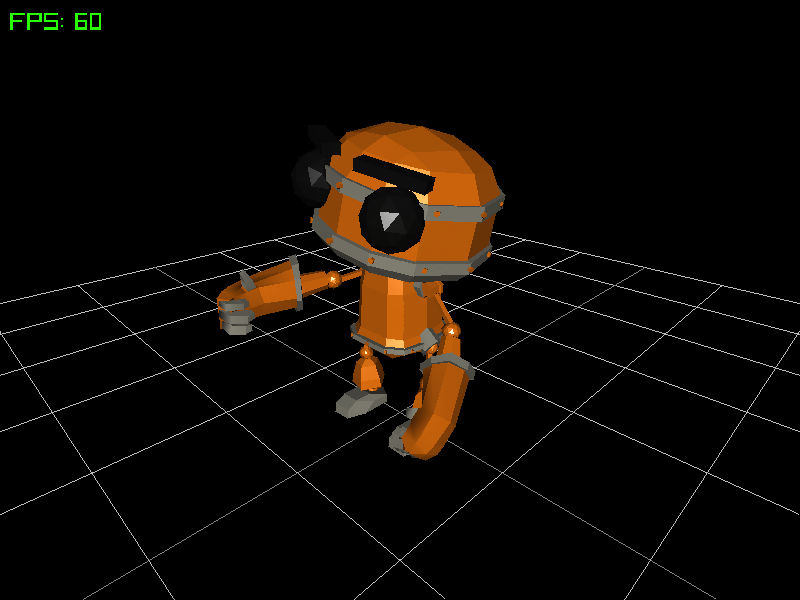
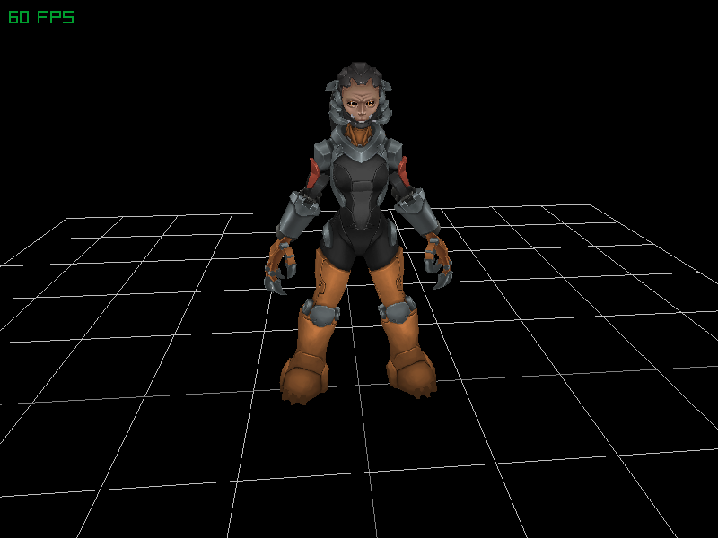
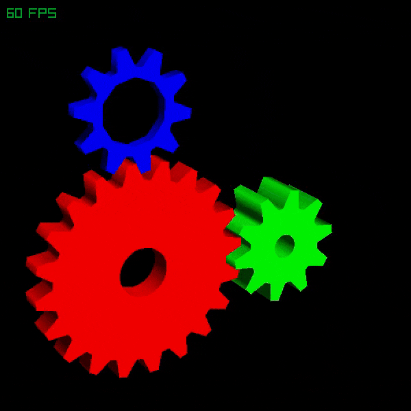

# PixelForge

PixelForge is a lightweight software rendering library written in standard C99, designed for versatile rendering without any external dependencies beyond the C standard library.

## Features

- **OpenGL-Like API**: PixelForge offers an API similar to OpenGL 1.X, making it easy for those familiar with OpenGL to adopt.
- **Multiple Contexts**: Enables the creation of multiple rendering contexts for various purposes.
- **Framebuffer Support**: Supports framebuffers, allowing rendering to different pixel buffers.
- **Texture Rendering**: Supports texture rendering with multiple wrapping modes and filtering options.
- **Texture Filtering**: As mentioned above, it supports bilinear or nearest neighbor filtering by default.
- **Blend Modes**: Supports various blend modes for color blending, allowing for effects like transparency and additive blending.
- **Primitive Rendering**: Efficiently renders points, lines, triangles, quads, strips, and fans. Additionally, it allows adjusting point size, line width, and polygon mode, enabling rendering of triangles and quads as lines or points.
- **Material Support**: Provides material rendering support via `pfMaterialf` and `pfMaterialfv`, similar to OpenGL 1.
- **Phong Lighting**: Supports rendering multiple lights using `pfLightfv`, with a default support for up to 8 lights, adjustable via a definition. The default lighting model is **Blinn-Phong**, but you can activate the Phong model with perfect reflection using `PF_PHONG_REFLECTION`.
- **Gouraud Shading**: If the Phong model is too slow, you can enable Gouraud shading via a `PF_GOURAUD_SHADING` definition, catering to different performance needs.
- **Post-Processing**: PixelForge supports post-processing effects through a customizable function pointer. Users can provide a function that takes the position (x, y, z) and color of each pixel on the screen and returns the color to be applied to that pixel. This feature makes it easy to implement various effects like fog, bloom, and color grading.
- **Double Buffering**: In scenarios where flickering during rendering needs to be avoided, double buffering can be used. You can define an auxiliary buffer and swap the buffers as necessary.
- **SIMD Support**: Optional SIMD support for SSE2/SSE3/SSE4.x/AVX2 is available for triangle rasterization and some other features.
- **OpenMP Support**: Optional OpenMP support is available, which can be used in conjunction with or independently of SIMD support. Definitions in `config.h` allow managing aspects of parallelization behavior.
- **Multiple Rasterization Modes**: PixelForge supports triangle rasterization via barycentric test/interpolation, which is used by default when SIMD and/or OpenMP support is enabled. If neither is enabled, rendering is done via scanlines, just like in the old days!

## Usage

1. Clone the repository:

   ```bash
   git clone https://github.com/Bigfoot71/PixelForge.git
   ```

2. Include the PixelForge header file in your project:

   ```c
   #include "pixelforge.h"
   ```

3. Compile and link your project with PixelForge library.

## Examples

The repository contains multiple examples showcasing how to use PixelForge with SDL2, raylib, the Windows API for Windows environments, and the X11 window server for Linux. These examples include functions for drawing models in raylib, as well as primitive drawing, projection configuration, and more, all of which can be utilized across different environments.

## License

This library is released under the [Zlib License](LICENSE).

## Contribution

Contributions are welcome! Please feel free to submit issues, feature requests, or pull requests.

## Screenshots



